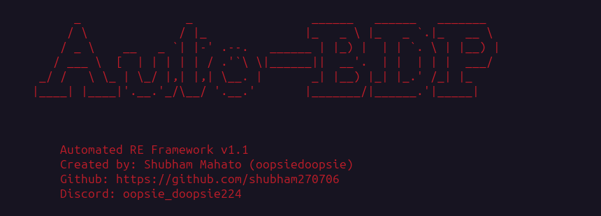
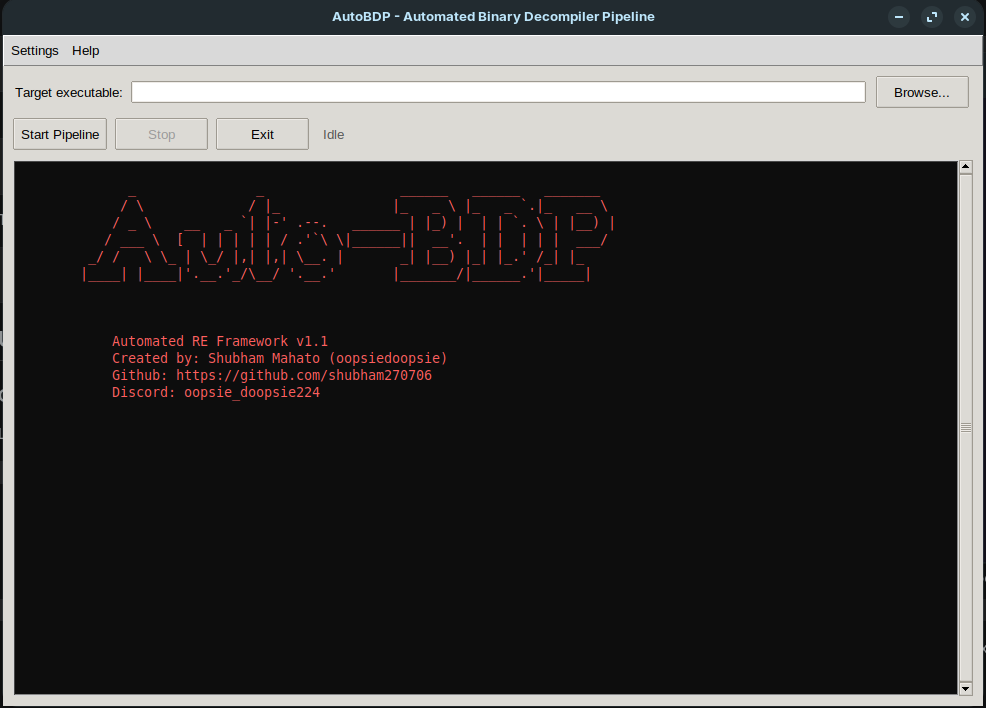
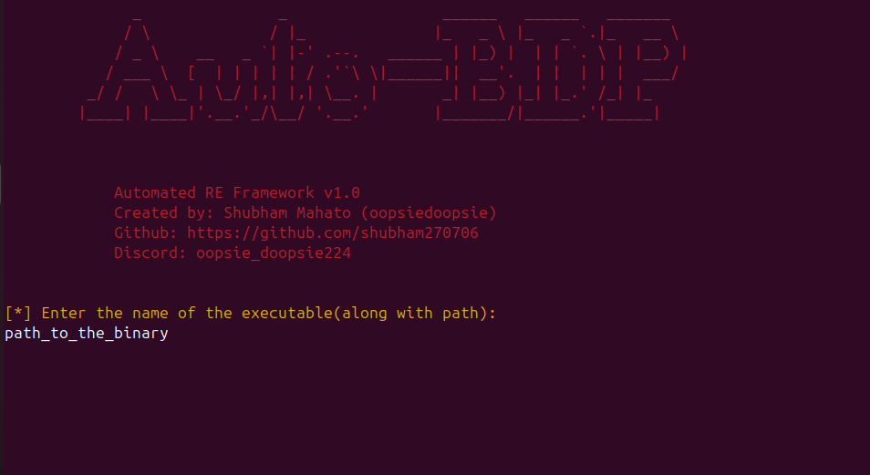
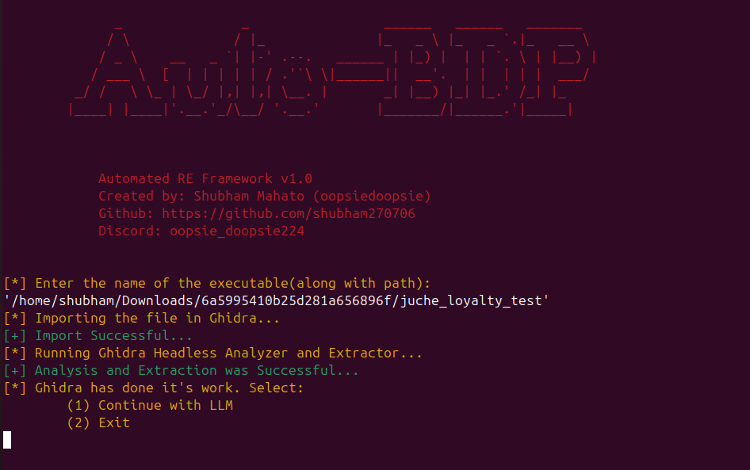
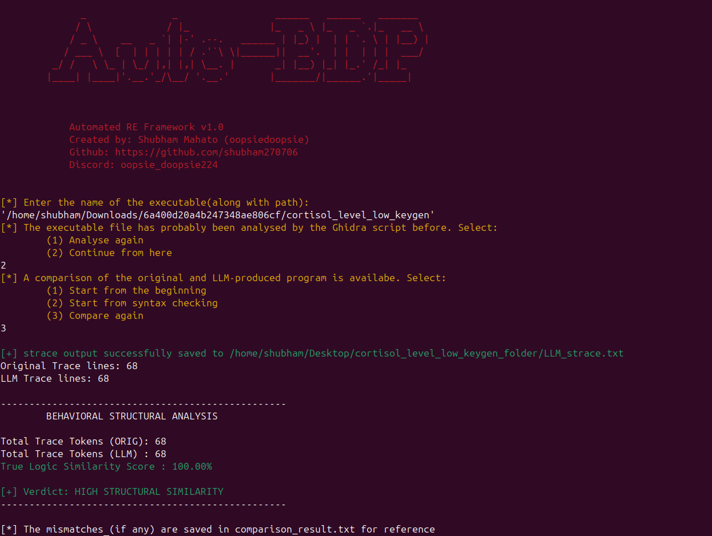

# Automated-Binary-Decompilation-Pipeline



AutoBDP is an automated reverse engineering framework that turns raw binaries back into compilable C code. It pairs headless Ghidra extraction with LLM code synthesis, automatically fixes syntax errors through a GCC compilation loop, and uses `strace` system call diffing to make sure the generated code behaves identically to the original binary.

It's available two ways:
- **GUI** — a desktop app with a colorized live console, file picker, and Stop/Exit controls, no terminal shenanigans required.
- **CLI** — the original terminal-driven workflow, still fully supported for scripting or headless use.

Who it's for: Security researchers, CTF players, malware analysts, and anyone for that matters, who wants to skip the manual decompilation grind and jump straight to working, readable source code.

## Installation

1. Get your Gemini-API Key at https://aistudio.google.com/

2. Copy the repo to Desktop
```text
git clone https://github.com/shubham270706/Automated-Binary-Decompilation-Pipeline.git

cd Automated-Binary-Decompilation-Pipeline
```
3. Run the Installation Script
```
chmod +x install.sh
sudo ./install.sh
```
4. Install the packages required by the Installation Script

5. Enter the Gemini-API Key when prompted
```
[*]Enter your Gemini API Key: <api_key here>
```

6. After the script runs successfully, refresh the source
```
source ~/.bashrc
```

7. Check the file 'LLM_stuff.py' file and verify the LLM Model used, specifically the functions: `LLM_request_for_c_code_analyze()` and `LLM_request_for_error()`

8. Check out the manual
```
man AutoBDP
```

9. Run AutoBDP
```
AutoBDP
```
   The `AutoBDP` command launches the **GUI** by default. If you'd rather use the original terminal-driven workflow, run the CLI script directly from the project directory instead:
   ```
   AutoBDP --headless
   ```

## Usage

### GUI

Launch with `AutoBDP` (or `python3 gui.py` from the project directory).



1. Click **Browse...** and select the target binary.
2. Click **Start Pipeline**. Ghidra import/analysis, LLM synthesis, compilation, and strace comparison all run in the background - progress and output stream into the console live, in color.
3. Whenever the pipeline needs a decision (resume vs. re-analyze, which compiler to use, etc.), a small popup collects your answer instead of blocking a terminal.

4. Use **Stop** at any point to halt the run - it kills any in-progress Ghidra subprocess immediately and interrupts LLM/compile retry loops at their next checkpoint (it can't forcibly cut off a single in-flight API request, only wait it out).
5. Use **Exit** to close the app; it'll offer to stop a running pipeline first.


Set your Gemini API key for the session from **Settings > Set Gemini API Key** if it isn't already in your environment.

### CLI

Run `AutoBDP --headless` and then enter the path to the binary file.


Choose the necessary options:






## Contributing

Contributions are what make the open source community such an amazing place to learn, inspire, and create. Any contributions you make are **greatly appreciated**.

If you have a suggestion that would make this better, please fork the repo and create a pull request. You can also simply open an issue with the tag "enhancement".
Don't forget to give the project a star! Thanks again!

1. Fork the Project
2. Create your Feature Branch (`git checkout -b feature/AmazingFeature`)
3. Commit your Changes (`git commit -m 'Add some AmazingFeature'`)
4. Push to the Branch (`git push origin feature/AmazingFeature`)
5. Open a Pull Request.


## Contact

Shubham Mahato - [@linkedin](https://www.linkedin.com/in/shubham-mahato-0ba387299/) - shubhammahato224@gmail.com

Project Link: [https://github.com/shubham270706/Automated-Binary-Decompilation-Pipeline](https://github.com/shubham270706/Automated-Binary-Decompilation-Pipeline)
## License

This project is licensed under the GNU Lesser General Public License v2.1 - see the [LICENSE](LICENSE.txt) file for details.

Copyright (c) 2026 Shubham Mahato
